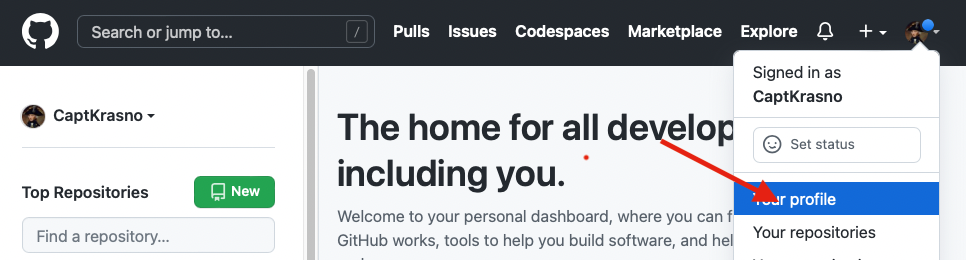
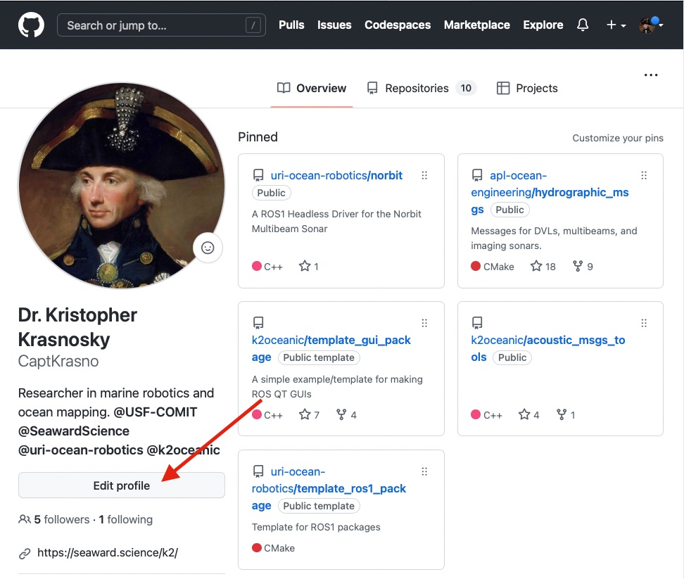
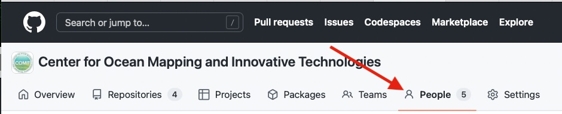
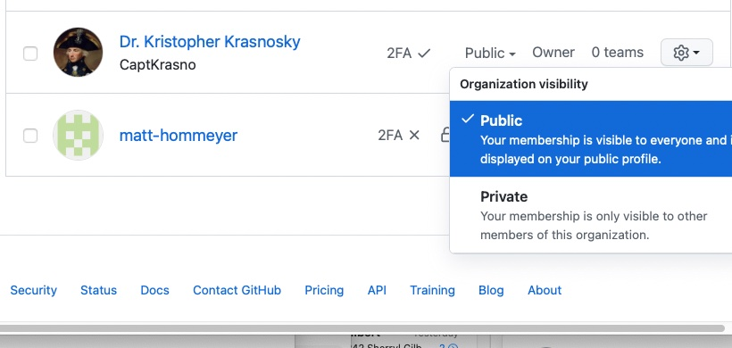

Steps For new Members
=====================

Welcome to the COMIT GitHub.   If you haven't received an innovation yet contact Kris Krasnosky or another administrator for access.  Once you have access please take the following steps to get onboard.

Step 1: Add some details to your profile
----------------------------------------

It can be hard to tell who's who with GitHub user names.  Please add a few details to your profile to help administrators manage permissions and to help followers track your contributions.

Begin by going to https://github.com and visiting your user profile.

  
Next click the update profile button and add add the following details

* Your Name
* A profile image or avatar

Step 2: Set your COMIT visibility
---------------------------------

Navigate to `The Comit GitHub Page <https://github.com/USF-COMIT>`_ and click the 'People' tab

then find your name in the list and select Public or Private.    If you are actively making contributions we encourage you to make yourself public!

.. note::
    If you want to show up on the public list of COMIT contributors you will need to set your organization visibility to **public**.

    .. image:: media/visibility_1.jpg
        :width: 600
        :alt: what is visibility

Step 3: Turn on 2 Factor Authentication
---------------------------------------

2 Factor authentication adds an extra layer of security both to your own account and the COMIT group account.   You are highly encouraged to enable it.

.. Warning::
    If you want permissions to create repositories, manage repositories, and/or manage the COMIT GitHub group you will need to enable 2 factor authentication.

Visit https://github.com/settings/security and select one of the many way to enable 2 factor authentication
